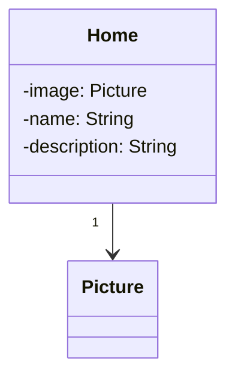

# Views

```mermaid
classDiagram
    class Home {
        -image: Picture
        -name: String
        -description: String
    }

    Home "1" --> Picture
```

## Home Page

The home page is going to contain a picture and my description.
